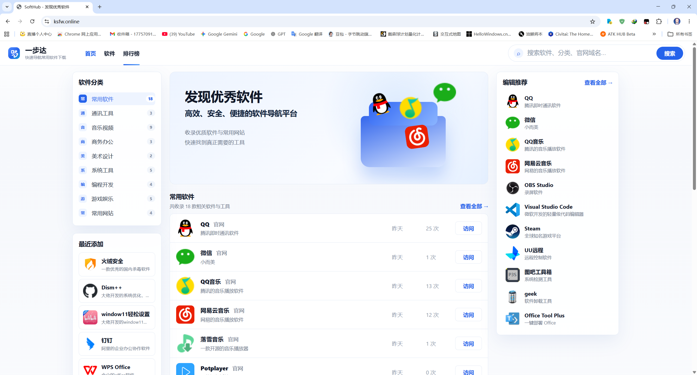
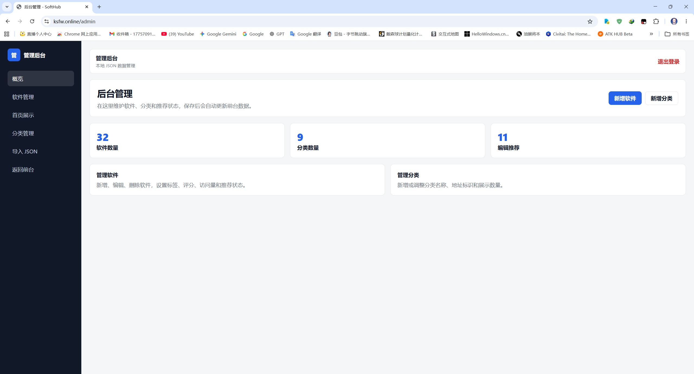

# 一步达

软件/网站导航站，Flask + JSON 数据文件实现。前台由 JavaScript 调用 API 动态渲染，后台使用 Flask 模板管理数据。





## 快速开始

```bash
# Linux / macOS
python -m venv .venv
source .venv/bin/activate
pip install -r requirements.txt
python app.py
```

```cmd
:: Windows CMD
python -m venv .venv
.venv\Scripts\activate
pip install -r requirements.txt
python app.py
```

打开 <http://127.0.0.1:5000> 访问前台，<http://127.0.0.1:5000/admin> 访问后台。

## 部署

生产环境使用 Waitress（已内置），不要用 Flask 开发服务器：

```bash
# Linux / macOS
export SOFTHUB_SECRET_KEY="$(python -c 'import secrets; print(secrets.token_urlsafe(32))')"
export SOFTHUB_ADMIN_USERNAME="admin"
export SOFTHUB_ADMIN_PASSWORD="你要设置的密码"

waitress-serve --host 127.0.0.1 --port 5000 app:app
```

```cmd
:: Windows CMD
set SOFTHUB_SECRET_KEY=随便输入一些字符
set SOFTHUB_ADMIN_USERNAME=admin
set SOFTHUB_ADMIN_PASSWORD=你的密码

waitress-serve --host 127.0.0.1 --port 5000 app:app
```

启动时如果使用了默认凭据，日志会输出安全警告。

## 环境变量

| 变量                           | 默认值   | 说明                                     |
| ------------------------------ | -------- | ---------------------------------------- |
| `SOFTHUB_SECRET_KEY`           | -        | Flask 会话密钥，**必须设置**为随机字符串 |
| `SOFTHUB_ADMIN_USERNAME`       | `admin`  | 后台登录账号                             |
| `SOFTHUB_ADMIN_PASSWORD`       | `123456` | 后台登录密码，**上线必须修改**           |
| `SOFTHUB_ENABLE_DATA_BACKUPS`  | `1`      | 是否启用 JSON 自动备份，设为 `0` 关闭    |
| `SOFTHUB_BACKUP_KEEP_PER_FILE` | `20`     | 每个 JSON 文件最多保留的备份数           |

## 页面与 API

### 前台页面

| 路径               | 说明                                       |
| ------------------ | ------------------------------------------ |
| `/`                | 首页，展示 Hero 区、推荐、最新、热门、分类 |
| `/category/<slug>` | 分类详情页                                 |
| `/rankings`        | 全站访问量排行榜                           |

### API

| 路径                       | 说明                                                      |
| -------------------------- | --------------------------------------------------------- |
| `/api/home`                | 首页数据（Hero、推荐、最新、热门、分类），支持 `?q=` 搜索 |
| `/api/category/<slug>`     | 分类数据及站点列表                                        |
| `/api/rankings`            | 排行榜数据                                                |
| `/api/search?q=&category=` | 搜索，最多返回 10 条                                      |
| `/api/categories`          | 全部分类及计数                                            |
| `/api/stats`               | 站点访问量和分类统计                                      |

### 后台

| 路径                     | 说明                                            |
| ------------------------ | ----------------------------------------------- |
| `/admin`                 | 仪表盘                                          |
| `/admin/sites`           | 站点管理（增删改、排序、批量推荐）              |
| `/admin/categories`      | 分类管理（增删改、排序、批量删除）              |
| `/admin/hero`            | 首页 Hero 区展示配置                            |
| `/admin/import`          | JSON 导入/导出                                  |
| `/admin/export/<target>` | 导出数据（sites / categories / settings / all） |

## 数据文件

所有数据以 JSON 文件存储在 `data/` 目录下：

```
data/
├── sites.json        # 站点列表（数组）
├── categories.json   # 分类列表（数组）
├── settings.json     # 首页配置（对象）
└── backups/          # 自动备份目录
```

### 备份机制

后台保存、删除、批量操作和 JSON 导入时，会在写入前自动备份旧的 JSON 文件到 `data/backups/`。访问量统计更新不触发备份，避免备份目录膨胀。每个文件最多保留 `BACKUP_KEEP_PER_FILE` 份备份，超出自动清理。

### 刷新缓存

如果手动修改 JSON 文件，登录后台后访问 `/refresh-data` 刷新内存缓存，无需重启。

## 项目结构

```
├── app.py               # 应用入口，工厂函数
├── config.py            # 环境变量配置 & 安全检查
├── nginx.conf           # Nginx 反向代理配置
├── requirements.txt
├── .env.example
│
├── routes/
│   ├── public.py        # 前台路由（首页 / 分类 / 排行 / 跳转）
│   ├── api.py           # REST API
│   └── admin.py         # 后台路由（CRUD / 导入导出）
│
├── services/
│   ├── catalog.py       # 数据读写、索引、缓存、分类统计
│   ├── search.py        # 搜索过滤与相关性打分
│   └── imports.py       # JSON 导入验证与规范化
│
├── utils/
│   ├── auth.py          # 登录校验、CSRF 防护
│   ├── converters.py    # 类型转换（to_int / to_float）
│   ├── formatters.py    # 展示格式化（访问量 / 时间）
│   ├── forms.py         # 表单解析与校验
│   └── urls.py          # URL 校验
│
├── templates/           # Jinja2 模板（后台页面）
├── static/              # 前端静态资源（CSS / JS / 图片）
└── data/                # JSON 数据文件 & 备份
```

### 架构说明

- **前台**：页面由 `templates/index.html` 等模板加载，数据通过 JavaScript 调用 `/api/*` 动态渲染
- **后台**：Flask 直接渲染 Jinja2 模板，POST 操作走 CSRF 校验
- **存储**：JSON 文件 + `lru_cache` 内存缓存，写操作使用线程锁保证并发安全
- **搜索**：分词后多维度打分（名称 > 分类 > 标签 > 域名 > 描述），支持缩写匹配

## 安全

- **并发安全**：所有写操作通过 `threading.Lock` 保护，防止多线程同时写入导致数据丢失
- **CSRF 防护**：后台所有 POST 请求校验 CSRF Token
- **密码保护**：登录使用常量时间比较（`secrets.compare_digest`）防时序攻击
- **重定向安全**：登录后回跳仅允许相对路径，防止开放重定向
- **启动检查**：使用默认凭据时输出安全警告
